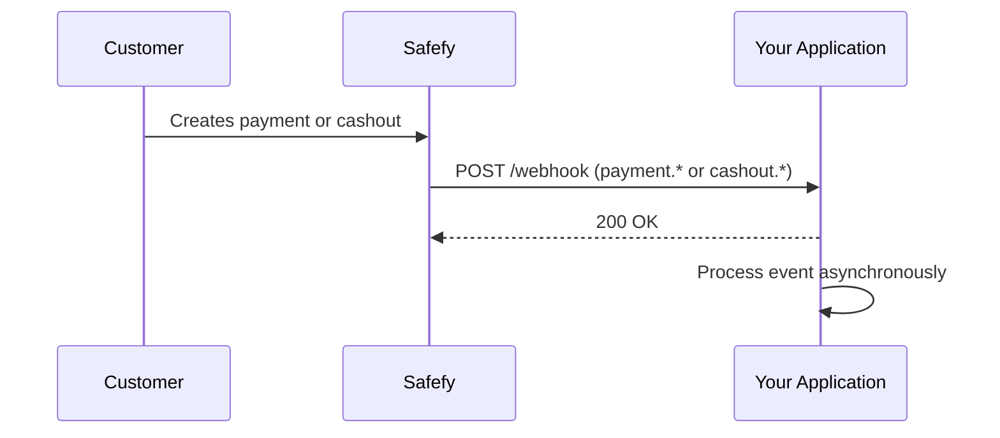
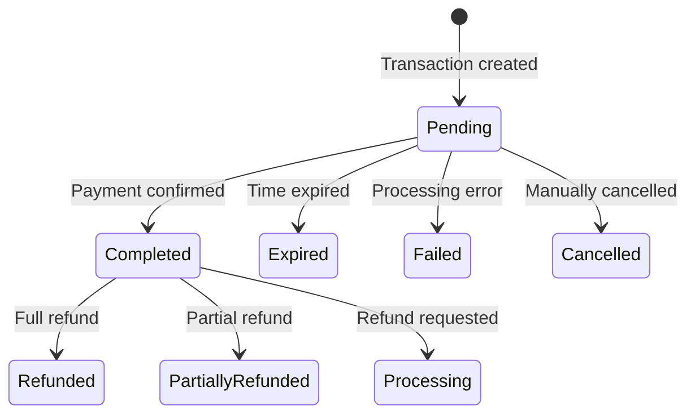

Webhooks allow your application to be notified automatically when changes happen in **payments** and **cashouts**.

## How it works

When you create a payment or cashout with `callbackUrl`, Safefy sends an HTTP `POST` request to that URL whenever status reaches a relevant state.



For full domain-specific payloads, see:

- [Transaction webhooks](/en/api-reference/transactions/webhooks)
- [Cashout webhooks](/en/api-reference/cashouts/webhooks)

---

## Payment events

| Event | Description | When it happens |
|--------|-----------|-----------------|
| `payment.completed` | Payment confirmed | When PIX is paid and confirmed by the bank |
| `payment.expired` | Transaction expired | When the payment window ends |
| `payment.failed` | Processing failed | When there is an acquirer or validation error |
| `payment.cancelled` | Payment cancelled | When the payment is manually cancelled |
| `payment.refunded` | Full refund | When a confirmed payment is refunded |
| `payment.partially_refunded` | Partial refund | When part of the payment is refunded |
| `payment.refund_requested` | Refund requested | When the refund is in processing |

---

## Cashout events

| Event | Cashout status |
|-------|----------------|
| `cashout.completed` | `Completed` |
| `cashout.failed` | `Failed` |
| `cashout.rejected` | `Rejected` |
| `cashout.cancelled` | `Cancelled` |

---

## Sent headers

| Header | Description |
|--------|-------------|
| `X-Safefy-Signature` | HMAC-SHA256 signature for validation |
| `X-Safefy-Event` | Event type (`payment.*` or `cashout.*`) |
| `X-Safefy-Delivery` | Unique delivery ID |
| `X-Safefy-Attempt` | Attempt number (`1`, `2`, `3`) |

---

## Signature

- For `payment.*` events, the secret is `paymentId`.
- For `cashout.*` events, the secret is `payoutId`.

Always validate the signature before processing the webhook.

---

## Retries

If your endpoint does not return `2xx`, Safefy retries:

1. Attempt 1 (immediate)
2. Attempt 2 after ~2 seconds
3. Attempt 3 after ~4 seconds

Recommendation: acknowledge quickly (`200 OK`) and process asynchronously.

---

## Idempotency

Because retries can happen, your webhook processing must be idempotent.

- Recommended key: `id` (delivery id) or `data.id + type`
- Ignore already-processed events

---

## Quick example

```json
{
  "id": "4d955fd7-cbb9-4d3c-8d36-4cb5de773b35",
  "type": "cashout.completed",
  "createdAt": "2026-02-25T12:00:00Z",
  "data": {
    "id": "8f8fce31-5c83-42c4-b90b-c29636b595e3",
    "status": "Completed",
    "amount": 50000,
    "netAmount": 49000
  }
}
```

---

## Payment status flow

Understand the transaction lifecycle and when each webhook is fired:



| Attempt | Interval |
|---------|----------|
| 1 | Immediate |
| 2 | 2 seconds |
| 3 | 4 seconds |

---

## Best practices

<CardGroup cols={2}>
  <Card title="Respond quickly" icon="bolt">
    Return 200 OK immediately and process the webhook asynchronously.
  </Card>
  <Card title="Be idempotent" icon="repeat">
    Use the webhook id to avoid processing the same event twice.
  </Card>
  <Card title="Validate the signature" icon="shield-check">
    Always verify X-Safefy-Signature before trusting the payload.
  </Card>
  <Card title="Use HTTPS" icon="lock">
    Configure your callbackUrl with HTTPS in production.
  </Card>
</CardGroup>
