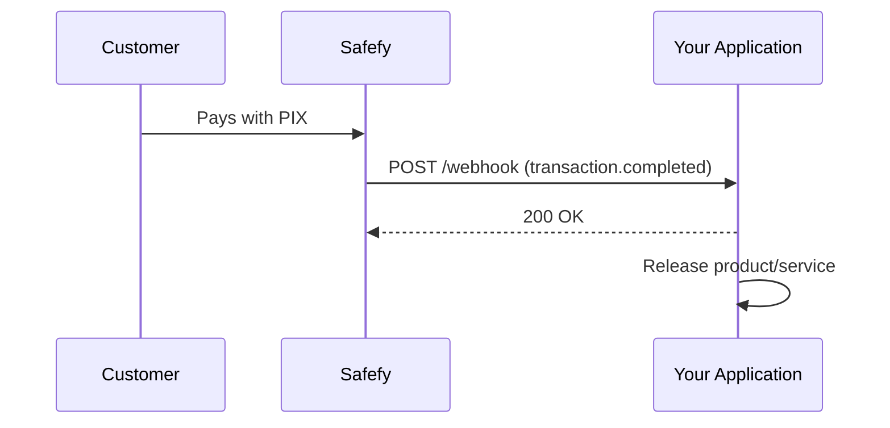
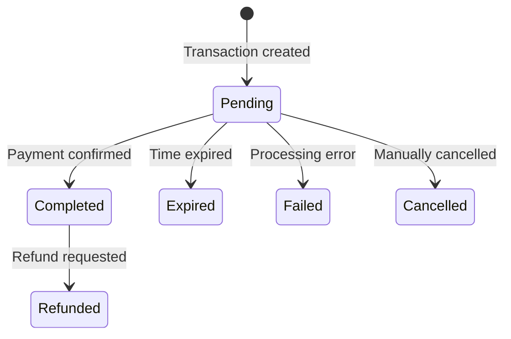

Webhooks allow your application to be notified automatically when something happens to your transactions.

## How it works

When you create a transaction with `callbackUrl`, Safefy sends an HTTP POST request to that URL whenever the status changes.



---

## Available events

### Transaction events

| Event | Description | When it happens |
|--------|-----------|-----------------|
| `transaction.completed` | Payment confirmed | When PIX is paid and confirmed by the bank |
| `transaction.expired` | Transaction expired | When the payment window ends (default: 30 min) |
| `transaction.failed` | Processing failed | When there is an acquirer or validation error |
| `transaction.refunded` | Payment refunded | When a confirmed payment is refunded |

### Cashout events

| Event | Description | When it happens |
|--------|-----------|-----------------|
| `cashout.completed` | Cashout completed | When PIX is sent to the destination account |
| `cashout.failed` | Cashout failed | When a cashout is rejected or fails |

---

## Transaction statuses

Understand the transaction lifecycle and when each webhook is fired:



### Details for each status

<AccordionGroup>
  <Accordion title="Pending - Awaiting payment">
    The transaction has been created and is waiting for the customer to pay.
    
    **What to do:** Show the QR Code/PIX copy-and-paste string and wait for confirmation.
    
    **Webhook:** No webhook is sent for this status.
  </Accordion>
  
  <Accordion title="Completed - Payment confirmed">
    The payment was received and confirmed by the bank. The amount is now available in your balance.
    
    **What to do:** Release the product/service to the customer.
    
    **Webhook:** `transaction.completed`
    
    **Important fields in the webhook:**
    - `data.completedAt` - Confirmation date/time
    - `data.pix.endToEndId` - Unique transaction ID at the Central Bank
    - `data.pix.payerName` - Payer name
    - `data.pix.payerDocument` - Payer document (masked)
    - `data.pix.payerBank` - Payer bank
  </Accordion>
  
  <Accordion title="Expired - Transaction expired">
    The payment window expired and the transaction was automatically cancelled.
    
    **What to do:** Inform the customer and offer a new attempt.
    
    **Webhook:** `transaction.expired`
  </Accordion>
  
  <Accordion title="Failed - Processing failed">
    An error occurred while processing the transaction.
    
    **What to do:** Check the `failureReason` field and take the appropriate action.
    
    **Webhook:** `transaction.failed`
    
    **Important field:** `data.failureReason` - Failure reason
  </Accordion>
  
  <Accordion title="Refunded - Payment refunded">
    The confirmed payment was refunded. The amount was returned to the payer.
    
    **What to do:** Revoke access to the product/service.
    
    **Webhook:** `transaction.refunded`
    
    **Important field:** `data.refundedAt` - Refund date/time
  </Accordion>
  
  <Accordion title="Cancelled - Transaction cancelled">
    The transaction was manually cancelled before payment.
    
    **What to do:** No action required.
    
    **Webhook:** No webhook is sent for manual cancellations.
  </Accordion>
</AccordionGroup>

---

## Example payloads

### transaction.completed

Sent when a PIX payment is confirmed:

```json
{
  "id": "whk_550e8400-e29b-41d4-a716-446655440000",
  "event": "transaction.completed",
  "createdAt": "2024-01-15T10:30:00Z",
  "data": {
    "id": "550e8400-e29b-41d4-a716-446655440000",
    "externalId": "order-123",
    "amount": 1000,
    "fee": 15,
    "netAmount": 985,
    "status": "Completed",
    "method": "Pix",
    "pix": {
      "txId": "SAFEFY2024011512345678901234",
      "endToEndId": "E12345678202401151030ABC123",
      "payerName": "Joao Silva",
      "payerDocument": "***456789**",
      "payerBank": "Banco do Brasil"
    },
    "completedAt": "2024-01-15T10:30:00Z"
  }
}
```

### transaction.expired

Sent when the payment window expires:

```json
{
  "id": "whk_661f9511-f3c8-52e5-b827-557766551111",
  "event": "transaction.expired",
  "createdAt": "2024-01-15T11:00:00Z",
  "data": {
    "id": "661f9511-f3c8-52e5-b827-557766551111",
    "externalId": "order-456",
    "amount": 5000,
    "fee": 75,
    "netAmount": 4925,
    "status": "Expired",
    "method": "Pix",
    "pix": {
      "txId": "SAFEFY2024011598765432101234",
      "endToEndId": null,
      "payerName": null,
      "payerDocument": null
    },
    "expiresAt": "2024-01-15T11:00:00Z"
  }
}
```

### transaction.refunded

Sent when a payment is refunded:

```json
{
  "id": "whk_772a0622-g4d9-63f6-c938-668877662222",
  "event": "transaction.refunded",
  "createdAt": "2024-01-15T14:00:00Z",
  "data": {
    "id": "550e8400-e29b-41d4-a716-446655440000",
    "externalId": "order-123",
    "amount": 1000,
    "fee": 15,
    "netAmount": 985,
    "status": "Refunded",
    "method": "Pix",
    "pix": {
      "txId": "SAFEFY2024011512345678901234",
      "endToEndId": "E12345678202401151030ABC123",
      "payerName": "Joao Silva",
      "payerDocument": "***456789**"
    },
    "completedAt": "2024-01-15T10:30:00Z",
    "refundedAt": "2024-01-15T14:00:00Z"
  }
}
```

### cashout.completed

Sent when a cashout is processed successfully:

```json
{
  "id": "whk_883b1733-h5e0-74g7-d049-779988773333",
  "event": "cashout.completed",
  "createdAt": "2024-01-15T16:00:00Z",
  "data": {
    "id": "b2c3d4e5-f6a7-8901-bcde-f23456789012",
    "externalId": "cashout_001",
    "amount": 50000,
    "fee": 200,
    "netAmount": 49800,
    "status": "Completed",
    "pix": {
      "pixKeyType": "CPF",
      "pixKey": "***456789**",
      "endToEndId": "E12345678202401151600xyz789abc012"
    },
    "requestedAt": "2024-01-15T15:50:00Z",
    "completedAt": "2024-01-15T16:00:00Z"
  }
}
```

---

## Sent headers

| Header | Description |
|--------|-----------|
| `X-Safefy-Signature` | HMAC-SHA256 signature for validation |
| `X-Safefy-Event` | Event type (transaction.completed, etc) |
| `X-Safefy-Delivery` | Unique delivery ID |
| `X-Safefy-Attempt` | Attempt number (1, 2, 3...) |

---

## Validating the signature

To ensure the webhook is from Safefy, validate the signature:

```javascript
const crypto = require('crypto');

function validateWebhook(payload, signature, secret) {
  const expected = crypto
    .createHmac('sha256', secret)
    .update(JSON.stringify(payload))
    .digest('hex');
  
  return crypto.timingSafeEqual(
    Buffer.from(signature),
    Buffer.from(expected)
  );
}
```

<Warning>
Always validate the signature before processing the webhook to avoid spoofing attacks.
</Warning>

---

## Retries

If your application does not respond with `2xx`, Safefy will retry:

| Attempt | Interval |
|-----------|-----------|
| 1 | Immediately |
| 2 | 1 minute |
| 3 | 5 minutes |
| 4 | 30 minutes |
| 5 | 2 hours |

---

## Best practices

<CardGroup cols={2}>
  <Card title="Respond quickly" icon="bolt">
    Return 200 OK immediately and process the webhook asynchronously.
  </Card>
  <Card title="Be idempotent" icon="repeat">
    Use the webhook id to avoid processing the same event twice.
  </Card>
  <Card title="Validate the signature" icon="shield-check">
    Always verify X-Safefy-Signature before trusting the payload.
  </Card>
  <Card title="Use HTTPS" icon="lock">
    Configure your callbackUrl with HTTPS in production.
  </Card>
</CardGroup>
