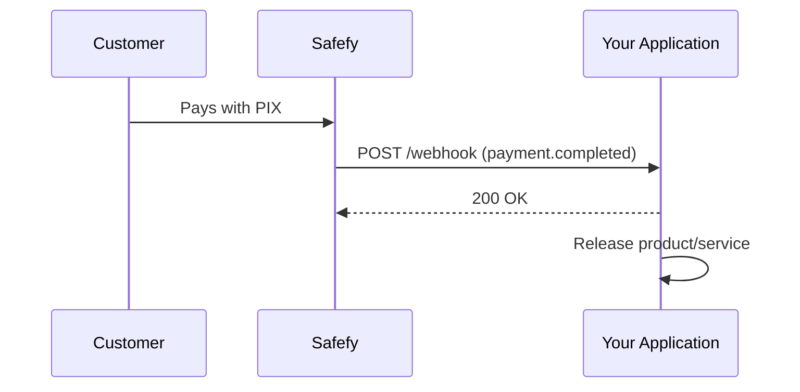
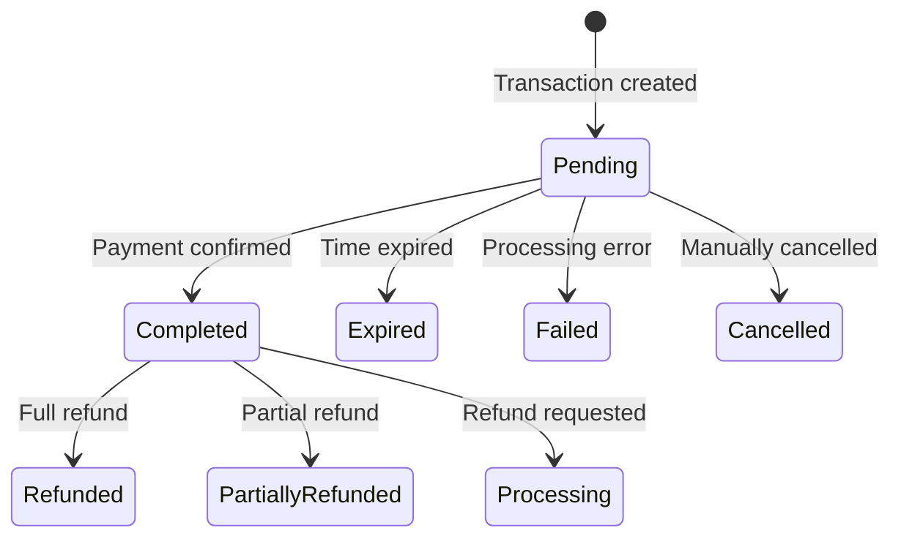

Webhooks allow your application to be notified automatically when something happens to your payments.

## How it works

When you create a transaction with `callbackUrl`, Safefy sends an HTTP POST request to that URL whenever the status changes.



For the complete list of webhook bodies, see [Transaction webhooks](/api-reference/transactions/webhooks).

---

## Available events

| Event | Description | When it happens |
|--------|-----------|-----------------|
| `payment.completed` | Payment confirmed | When PIX is paid and confirmed by the bank |
| `payment.expired` | Transaction expired | When the payment window ends |
| `payment.failed` | Processing failed | When there is an acquirer or validation error |
| `payment.cancelled` | Payment cancelled | When the payment is manually cancelled |
| `payment.refunded` | Full refund | When a confirmed payment is refunded |
| `payment.partially_refunded` | Partial refund | When part of the payment is refunded |
| `payment.refund_requested` | Refund requested | When the refund is in processing |

---

## Transaction statuses

Understand the transaction lifecycle and when each webhook is fired:



### Details for each status

<AccordionGroup>
  <Accordion title="Pending - Awaiting payment">
    The transaction has been created and is waiting for the customer to pay.
    
    **What to do:** Show the QR Code/PIX copy-and-paste string and wait for confirmation.
    
    **Webhook:** No webhook is sent for this status.
  </Accordion>
  
  <Accordion title="Completed - Payment confirmed">
    The payment was received and confirmed by the bank. The amount is now available in your balance.
    
    **What to do:** Release the product/service to the customer.
    
    **Webhook:** `payment.completed`
    
    **Important fields in the webhook:**
    - `data.completedAt` - Confirmation date/time
    - `data.pix.endToEndId` - Unique transaction ID at the Central Bank
    - `data.pix.payerName` - Payer name
    - `data.pix.payerDocument` - Payer document (masked)
    - `data.pix.payerBank` - Payer bank
  </Accordion>
  
  <Accordion title="Expired - Transaction expired">
    The payment window expired and the transaction was automatically cancelled.
    
    **What to do:** Inform the customer and offer a new attempt.
    
    **Webhook:** `payment.expired`
  </Accordion>
  
  <Accordion title="Failed - Processing failed">
    An error occurred while processing the transaction.
    
    **What to do:** Check the `failureReason` field and take the appropriate action.
    
    **Webhook:** `payment.failed`
    
    **Important field:** `data.failureReason` - Failure reason
  </Accordion>
  
  <Accordion title="Cancelled - Transaction cancelled">
    The transaction was manually cancelled before payment.
    
    **What to do:** No action required.
    
    **Webhook:** `payment.cancelled`
  </Accordion>
  
  <Accordion title="Refunded - Payment refunded">
    The confirmed payment was refunded. The amount was returned to the payer.
    
    **What to do:** Revoke access to the product/service.
    
    **Webhook:** `payment.refunded`
    
    **Important field:** `data.refundedAt` - Refund date/time
  </Accordion>

  <Accordion title="PartiallyRefunded - Partial refund">
    Part of the payment was refunded.
    
    **What to do:** Adjust access according to your refund policy.
    
    **Webhook:** `payment.partially_refunded`
  </Accordion>

  <Accordion title="Processing - Refund requested">
    A refund was requested and is being processed.
    
    **What to do:** Wait for the final refund outcome.
    
    **Webhook:** `payment.refund_requested`
  </Accordion>
</AccordionGroup>

---

## Example payloads

### payment.completed

```json
{
  "id": "whk_550e8400-e29b-41d4-a716-446655440000",
  "type": "payment.completed",
  "createdAt": "2025-01-15T10:30:00Z",
  "data": {
    "id": "550e8400-e29b-41d4-a716-446655440000",
    "externalId": "order-123",
    "amount": 1000,
    "fee": 15,
    "netAmount": 985,
    "currency": "BRL",
    "method": "Pix",
    "status": "Completed",
    "environment": "Production",
    "description": "Purchase at Store XYZ",
    "completedAt": "2025-01-15T10:30:00Z",
    "refundedAt": null,
    "expiresAt": "2025-01-15T11:00:00Z",
    "failureReason": null,
    "customerId": "550e8400-e29b-41d4-a716-446655440001",
    "pix": {
      "txId": "SAFEFY2025011512345678901234",
      "endToEndId": "E12345678202501151030ABC123",
      "payerName": "Joao Silva",
      "payerDocument": "***456789**",
      "payerBank": "Banco do Brasil"
    }
  }
}
```

### payment.failed

```json
{
  "id": "whk_661f9511-f3c8-52e5-b827-557766551111",
  "type": "payment.failed",
  "createdAt": "2025-01-15T11:00:00Z",
  "data": {
    "id": "661f9511-f3c8-52e5-b827-557766551111",
    "externalId": "order-456",
    "amount": 5000,
    "fee": 75,
    "netAmount": 4925,
    "currency": "BRL",
    "method": "Pix",
    "status": "Failed",
    "environment": "Production",
    "description": "Processing failed",
    "completedAt": null,
    "refundedAt": null,
    "expiresAt": "2025-01-15T11:10:00Z",
    "failureReason": "Processing failed",
    "customerId": null,
    "pix": {
      "txId": "SAFEFY2025011598765432101234",
      "endToEndId": null,
      "payerName": null,
      "payerDocument": null,
      "payerBank": null
    }
  }
}
```

---

## Headers sent

| Header | Description |
|--------|-----------|
| `X-Safefy-Signature` | HMAC-SHA256 signature for validation |
| `X-Safefy-Event` | Event type (payment.completed, etc) |
| `X-Safefy-Delivery` | Unique delivery ID |
| `X-Safefy-Attempt` | Attempt number (1, 2, 3) |

---

## Validating the signature

To ensure the webhook came from Safefy, validate the signature using the `paymentId` as the secret.

<CodeGroup>
```javascript JavaScript
import crypto from 'crypto';

export function validateWebhook(rawBody, signature, paymentId) {
  const expected = 'sha256=' + crypto
    .createHmac('sha256', paymentId)
    .update(rawBody)
    .digest('hex');

  return crypto.timingSafeEqual(
    Buffer.from(signature),
    Buffer.from(expected)
  );
}
```

```typescript TypeScript
import crypto from 'crypto';

export function validateWebhook(
  rawBody: string,
  signature: string,
  paymentId: string
): boolean {
  const expected = 'sha256=' + crypto
    .createHmac('sha256', paymentId)
    .update(rawBody)
    .digest('hex');

  return crypto.timingSafeEqual(
    Buffer.from(signature),
    Buffer.from(expected)
  );
}
```

```python Python
import hmac
import hashlib

def validate_webhook(raw_body: str, signature: str, payment_id: str) -> bool:
    expected = 'sha256=' + hmac.new(
        payment_id.encode('utf-8'),
        raw_body.encode('utf-8'),
        hashlib.sha256
    ).hexdigest()

    return hmac.compare_digest(signature, expected)
```

```csharp C#
using System.Security.Cryptography;
using System.Text;

public static bool ValidateWebhook(string rawBody, string signature, string paymentId)
{
    using var hmac = new HMACSHA256(Encoding.UTF8.GetBytes(paymentId));
    var hash = hmac.ComputeHash(Encoding.UTF8.GetBytes(rawBody));
    var expected = "sha256=" + Convert.ToHexString(hash).ToLower();
    return CryptographicOperations.FixedTimeEquals(
        Encoding.UTF8.GetBytes(signature),
        Encoding.UTF8.GetBytes(expected)
    );
}
```

```go Go
package webhooks

import (
  "crypto/hmac"
  "crypto/sha256"
  "encoding/hex"
)

func ValidateWebhook(rawBody, signature, paymentId string) bool {
  mac := hmac.New(sha256.New, []byte(paymentId))
  mac.Write([]byte(rawBody))
  expected := "sha256=" + hex.EncodeToString(mac.Sum(nil))
  return hmac.Equal([]byte(signature), []byte(expected))
}
```
</CodeGroup>

<Warning>
Always validate the signature before processing the webhook.
</Warning>

---

## Retries

If your application does not respond with `2xx`, Safefy will retry up to 3 times:

| Attempt | Interval |
|---------|----------|
| 1 | Immediate |
| 2 | 2 seconds |
| 3 | 4 seconds |

---

## Best practices

<CardGroup cols={2}>
  <Card title="Respond quickly" icon="bolt">
    Return 200 OK immediately and process the webhook asynchronously.
  </Card>
  <Card title="Be idempotent" icon="repeat">
    Use the webhook id to avoid processing the same event twice.
  </Card>
  <Card title="Validate the signature" icon="shield-check">
    Always verify X-Safefy-Signature before trusting the payload.
  </Card>
  <Card title="Use HTTPS" icon="lock">
    Configure your callbackUrl with HTTPS in production.
  </Card>
</CardGroup>
