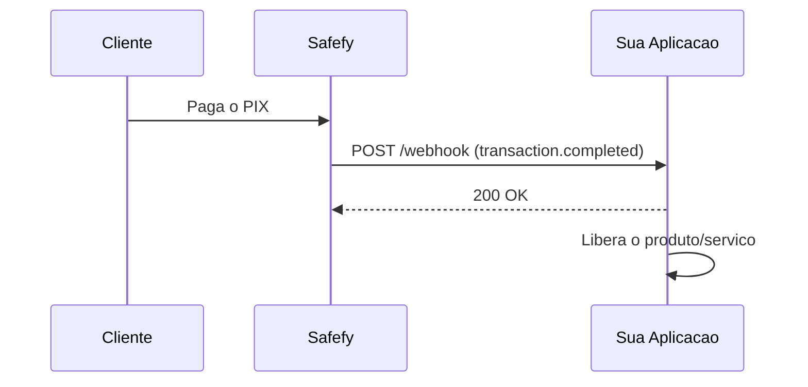
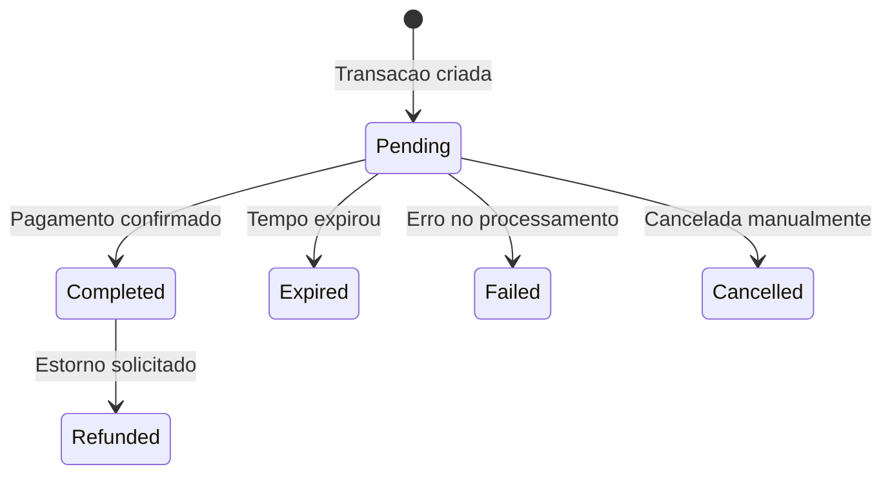

Webhooks permitem que sua aplicacao seja notificada automaticamente quando algo acontece com suas transacoes.

## Como funciona

Quando voce cria uma transacao com `callbackUrl`, a Safefy envia uma requisicao HTTP POST para essa URL sempre que o status mudar.



---

## Eventos disponiveis

### Eventos de Transacao

| Evento | Descricao | Quando acontece |
|--------|-----------|-----------------|
| `transaction.completed` | Pagamento confirmado | Quando o PIX e pago e confirmado pelo banco |
| `transaction.expired` | Transacao expirou | Quando o prazo para pagamento esgota (padrao: 30 min) |
| `transaction.failed` | Falha no processamento | Quando ocorre erro na adquirente ou validacao |
| `transaction.refunded` | Pagamento estornado | Quando um pagamento confirmado e estornado |

### Eventos de Saque

| Evento | Descricao | Quando acontece |
|--------|-----------|-----------------|
| `cashout.completed` | Saque concluido | Quando o PIX e enviado para a conta destino |
| `cashout.failed` | Falha no saque | Quando o saque e rejeitado ou falha |

---

## Status das transacoes

Entenda o ciclo de vida de uma transacao e quando cada webhook e disparado:



### Detalhes de cada status

<AccordionGroup>
  <Accordion title="Pending - Aguardando pagamento">
    A transacao foi criada e esta aguardando o pagamento do cliente.
    
    **O que fazer:** Exiba o QR Code/codigo PIX para o cliente e aguarde a confirmacao.
    
    **Webhook:** Nenhum webhook e enviado neste status.
  </Accordion>
  
  <Accordion title="Completed - Pagamento confirmado">
    O pagamento foi recebido e confirmado pelo banco. O valor ja esta disponivel no seu saldo.
    
    **O que fazer:** Libere o produto/servico para o cliente.
    
    **Webhook:** `transaction.completed`
    
    **Campos importantes no webhook:**
    - `data.completedAt` - Data/hora da confirmacao
    - `data.pix.endToEndId` - ID unico da transacao no Banco Central
    - `data.pix.payerName` - Nome do pagador
    - `data.pix.payerDocument` - Documento do pagador (mascarado)
    - `data.pix.payerBank` - Banco do pagador
  </Accordion>
  
  <Accordion title="Expired - Transacao expirada">
    O tempo para pagamento expirou e a transacao foi automaticamente cancelada.
    
    **O que fazer:** Informe o cliente que o tempo expirou e ofereca uma nova tentativa.
    
    **Webhook:** `transaction.expired`
  </Accordion>
  
  <Accordion title="Failed - Falha no processamento">
    Ocorreu um erro durante o processamento da transacao.
    
    **O que fazer:** Verifique o campo `failureReason` e tome a acao apropriada.
    
    **Webhook:** `transaction.failed`
    
    **Campo importante:** `data.failureReason` - Motivo da falha
  </Accordion>
  
  <Accordion title="Refunded - Pagamento estornado">
    O pagamento confirmado foi estornado. O valor foi devolvido ao pagador.
    
    **O que fazer:** Revogue o acesso ao produto/servico.
    
    **Webhook:** `transaction.refunded`
    
    **Campo importante:** `data.refundedAt` - Data/hora do estorno
  </Accordion>
  
  <Accordion title="Cancelled - Transacao cancelada">
    A transacao foi cancelada manualmente antes do pagamento.
    
    **O que fazer:** Nenhuma acao necessaria.
    
    **Webhook:** Nenhum webhook e enviado para cancelamento manual.
  </Accordion>
</AccordionGroup>

---

## Payload de exemplo

### transaction.completed

Enviado quando o pagamento PIX e confirmado:

```json
{
  "id": "whk_550e8400-e29b-41d4-a716-446655440000",
  "event": "transaction.completed",
  "createdAt": "2024-01-15T10:30:00Z",
  "data": {
    "id": "550e8400-e29b-41d4-a716-446655440000",
    "externalId": "pedido-123",
    "amount": 1000,
    "fee": 15,
    "netAmount": 985,
    "status": "Completed",
    "method": "Pix",
    "pix": {
      "txId": "SAFEFY2024011512345678901234",
      "endToEndId": "E12345678202401151030ABC123",
      "payerName": "Joao Silva",
      "payerDocument": "***456789**",
      "payerBank": "Banco do Brasil"
    },
    "completedAt": "2024-01-15T10:30:00Z"
  }
}
```

### transaction.expired

Enviado quando o tempo de pagamento esgota:

```json
{
  "id": "whk_661f9511-f3c8-52e5-b827-557766551111",
  "event": "transaction.expired",
  "createdAt": "2024-01-15T11:00:00Z",
  "data": {
    "id": "661f9511-f3c8-52e5-b827-557766551111",
    "externalId": "pedido-456",
    "amount": 5000,
    "fee": 75,
    "netAmount": 4925,
    "status": "Expired",
    "method": "Pix",
    "pix": {
      "txId": "SAFEFY2024011598765432101234",
      "endToEndId": null,
      "payerName": null,
      "payerDocument": null
    },
    "expiresAt": "2024-01-15T11:00:00Z"
  }
}
```

### transaction.refunded

Enviado quando um pagamento e estornado:

```json
{
  "id": "whk_772a0622-g4d9-63f6-c938-668877662222",
  "event": "transaction.refunded",
  "createdAt": "2024-01-15T14:00:00Z",
  "data": {
    "id": "550e8400-e29b-41d4-a716-446655440000",
    "externalId": "pedido-123",
    "amount": 1000,
    "fee": 15,
    "netAmount": 985,
    "status": "Refunded",
    "method": "Pix",
    "pix": {
      "txId": "SAFEFY2024011512345678901234",
      "endToEndId": "E12345678202401151030ABC123",
      "payerName": "Joao Silva",
      "payerDocument": "***456789**"
    },
    "completedAt": "2024-01-15T10:30:00Z",
    "refundedAt": "2024-01-15T14:00:00Z"
  }
}
```

### cashout.completed

Enviado quando um saque e processado com sucesso:

```json
{
  "id": "whk_883b1733-h5e0-74g7-d049-779988773333",
  "event": "cashout.completed",
  "createdAt": "2024-01-15T16:00:00Z",
  "data": {
    "id": "b2c3d4e5-f6a7-8901-bcde-f23456789012",
    "externalId": "saque_001",
    "amount": 50000,
    "fee": 200,
    "netAmount": 49800,
    "status": "Completed",
    "pix": {
      "pixKeyType": "CPF",
      "pixKey": "***456789**",
      "endToEndId": "E12345678202401151600xyz789abc012"
    },
    "requestedAt": "2024-01-15T15:50:00Z",
    "completedAt": "2024-01-15T16:00:00Z"
  }
}
```

---

## Headers enviados

| Header | Descricao |
|--------|-----------|
| `X-Safefy-Signature` | Assinatura HMAC-SHA256 para validacao |
| `X-Safefy-Event` | Tipo do evento (transaction.completed, etc) |
| `X-Safefy-Delivery` | ID unico da entrega |
| `X-Safefy-Attempt` | Numero da tentativa (1, 2, 3...) |

---

## Validando a assinatura

Para garantir que o webhook veio da Safefy, valide a assinatura:

```javascript
const crypto = require('crypto');

function validateWebhook(payload, signature, secret) {
  const expected = crypto
    .createHmac('sha256', secret)
    .update(JSON.stringify(payload))
    .digest('hex');
  
  return crypto.timingSafeEqual(
    Buffer.from(signature),
    Buffer.from(expected)
  );
}
```

<Warning>
Sempre valide a assinatura antes de processar o webhook para evitar ataques de spoofing.
</Warning>

---

## Retries

Se sua aplicacao nao responder com `2xx`, a Safefy tentara novamente:

| Tentativa | Intervalo |
|-----------|-----------|
| 1 | Imediato |
| 2 | 1 minuto |
| 3 | 5 minutos |
| 4 | 30 minutos |
| 5 | 2 horas |

---

## Boas praticas

<CardGroup cols={2}>
  <Card title="Responda rapido" icon="bolt">
    Retorne 200 OK imediatamente e processe o webhook de forma assincrona.
  </Card>
  <Card title="Seja idempotente" icon="repeat">
    Use o id do webhook para evitar processar o mesmo evento duas vezes.
  </Card>
  <Card title="Valide a assinatura" icon="shield-check">
    Sempre verifique X-Safefy-Signature antes de confiar no payload.
  </Card>
  <Card title="Use HTTPS" icon="lock">
    Configure sua callbackUrl apenas com HTTPS em producao.
  </Card>
</CardGroup>
