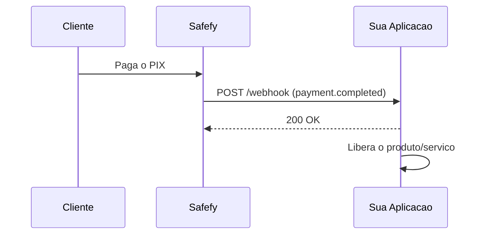

Webhooks permitem que sua aplicacao seja notificada automaticamente quando algo acontece com seus pagamentos.

## Como funciona

Quando voce cria uma transacao com `callbackUrl`, a Safefy envia uma requisicao HTTP POST para essa URL sempre que o status mudar.



Se quiser o detalhamento completo dos corpos de webhook, veja [Webhooks de transacao](/api-reference/transactions/webhooks).

---

## Eventos disponiveis

| Evento | Descricao | Quando acontece |
|--------|-----------|-----------------|
| `payment.completed` | Pagamento confirmado | Quando o PIX e pago e confirmado pelo banco |
| `payment.expired` | Transacao expirou | Quando o prazo para pagamento esgota |
| `payment.failed` | Falha no processamento | Quando ocorre erro na adquirente ou validacao |
| `payment.cancelled` | Pagamento cancelado | Quando o pagamento e cancelado manualmente |
| `payment.refunded` | Estorno total | Quando um pagamento confirmado e estornado |
| `payment.partially_refunded` | Estorno parcial | Quando parte do pagamento e estornada |
| `payment.refund_requested` | Estorno solicitado | Quando o estorno entra em processamento |

---

## Status das transacoes

Entenda o ciclo de vida de uma transacao e quando cada webhook e disparado:


### Detalhes de cada status

<AccordionGroup>
  <Accordion title="Pending - Aguardando pagamento">
    A transacao foi criada e esta aguardando o pagamento do cliente.
    
    **O que fazer:** Exiba o QR Code/codigo PIX para o cliente e aguarde a confirmacao.
    
    **Webhook:** Nenhum webhook e enviado neste status.
  </Accordion>
  
  <Accordion title="Completed - Pagamento confirmado">
    O pagamento foi recebido e confirmado pelo banco. O valor ja esta disponivel no seu saldo.
    
    **O que fazer:** Libere o produto/servico para o cliente.
    
    **Webhook:** `payment.completed`
    
    **Campos importantes no webhook:**
    - `data.completedAt` - Data/hora da confirmacao
    - `data.pix.endToEndId` - ID unico da transacao no Banco Central
    - `data.pix.payerName` - Nome do pagador
    - `data.pix.payerDocument` - Documento do pagador (mascarado)
    - `data.pix.payerBank` - Banco do pagador
  </Accordion>
  
  <Accordion title="Expired - Transacao expirada">
    O tempo para pagamento expirou e a transacao foi automaticamente cancelada.
    
    **O que fazer:** Informe o cliente que o tempo expirou e ofereca uma nova tentativa.
    
    **Webhook:** `payment.expired`
  </Accordion>
  
  <Accordion title="Failed - Falha no processamento">
    Ocorreu um erro durante o processamento da transacao.
    
    **O que fazer:** Verifique o campo `failureReason` e tome a acao apropriada.
    
    **Webhook:** `payment.failed`
    
    **Campo importante:** `data.failureReason` - Motivo da falha
  </Accordion>
  
  <Accordion title="Cancelled - Transacao cancelada">
    A transacao foi cancelada manualmente antes do pagamento.
    
    **O que fazer:** Nenhuma acao necessaria.
    
    **Webhook:** `payment.cancelled`
  </Accordion>
  
  <Accordion title="Refunded - Pagamento estornado">
    O pagamento confirmado foi estornado. O valor foi devolvido ao pagador.
    
    **O que fazer:** Revogue o acesso ao produto/servico.
    
    **Webhook:** `payment.refunded`
    
    **Campo importante:** `data.refundedAt` - Data/hora do estorno
  </Accordion>

  <Accordion title="PartiallyRefunded - Estorno parcial">
    Parte do pagamento foi estornada.
    
    **O que fazer:** Ajuste o acesso do cliente de acordo com a politica de estorno.
    
    **Webhook:** `payment.partially_refunded`
  </Accordion>

  <Accordion title="Processing - Estorno solicitado">
    Um estorno foi solicitado e esta em processamento.
    
    **O que fazer:** Aguarde o resultado final do estorno.
    
    **Webhook:** `payment.refund_requested`
  </Accordion>
</AccordionGroup>

---

## Payload de exemplo

### payment.completed

```json
{
  "id": "whk_550e8400-e29b-41d4-a716-446655440000",
  "type": "payment.completed",
  "createdAt": "2025-01-15T10:30:00Z",
  "data": {
    "id": "550e8400-e29b-41d4-a716-446655440000",
    "externalId": "pedido-123",
    "amount": 1000,
    "fee": 15,
    "netAmount": 985,
    "currency": "BRL",
    "method": "Pix",
    "status": "Completed",
    "environment": "Production",
    "description": "Compra na Loja XYZ",
    "completedAt": "2025-01-15T10:30:00Z",
    "refundedAt": null,
    "expiresAt": "2025-01-15T11:00:00Z",
    "failureReason": null,
    "customerId": "550e8400-e29b-41d4-a716-446655440001",
    "pix": {
      "txId": "SAFEFY2025011512345678901234",
      "endToEndId": "E12345678202501151030ABC123",
      "payerName": "Joao Silva",
      "payerDocument": "***456789**",
      "payerBank": "Banco do Brasil"
    }
  }
}
```

### payment.failed

```json
{
  "id": "whk_661f9511-f3c8-52e5-b827-557766551111",
  "type": "payment.failed",
  "createdAt": "2025-01-15T11:00:00Z",
  "data": {
    "id": "661f9511-f3c8-52e5-b827-557766551111",
    "externalId": "pedido-456",
    "amount": 5000,
    "fee": 75,
    "netAmount": 4925,
    "currency": "BRL",
    "method": "Pix",
    "status": "Failed",
    "environment": "Production",
    "description": "Falha no processamento",
    "completedAt": null,
    "refundedAt": null,
    "expiresAt": "2025-01-15T11:10:00Z",
    "failureReason": "Falha no processamento",
    "customerId": null,
    "pix": {
      "txId": "SAFEFY2025011598765432101234",
      "endToEndId": null,
      "payerName": null,
      "payerDocument": null,
      "payerBank": null
    }
  }
}
```

---

## Headers enviados

| Header | Descricao |
|--------|-----------|
| `X-Safefy-Signature` | Assinatura HMAC-SHA256 para validacao |
| `X-Safefy-Event` | Tipo do evento (payment.completed, etc) |
| `X-Safefy-Delivery` | ID unico da entrega |
| `X-Safefy-Attempt` | Numero da tentativa (1, 2, 3) |

---

## Validando a assinatura

Para garantir que o webhook veio da Safefy, valide a assinatura usando o `paymentId` como secret.

<CodeGroup>
```javascript JavaScript
import crypto from 'crypto';

export function validateWebhook(rawBody, signature, paymentId) {
  const expected = 'sha256=' + crypto
    .createHmac('sha256', paymentId)
    .update(rawBody)
    .digest('hex');

  return crypto.timingSafeEqual(
    Buffer.from(signature),
    Buffer.from(expected)
  );
}
```

```typescript TypeScript
import crypto from 'crypto';

export function validateWebhook(
  rawBody: string,
  signature: string,
  paymentId: string
): boolean {
  const expected = 'sha256=' + crypto
    .createHmac('sha256', paymentId)
    .update(rawBody)
    .digest('hex');

  return crypto.timingSafeEqual(
    Buffer.from(signature),
    Buffer.from(expected)
  );
}
```

```python Python
import hmac
import hashlib

def validate_webhook(raw_body: str, signature: str, payment_id: str) -> bool:
    expected = 'sha256=' + hmac.new(
        payment_id.encode('utf-8'),
        raw_body.encode('utf-8'),
        hashlib.sha256
    ).hexdigest()

    return hmac.compare_digest(signature, expected)
```

```csharp C#
using System.Security.Cryptography;
using System.Text;

public static bool ValidateWebhook(string rawBody, string signature, string paymentId)
{
    using var hmac = new HMACSHA256(Encoding.UTF8.GetBytes(paymentId));
    var hash = hmac.ComputeHash(Encoding.UTF8.GetBytes(rawBody));
    var expected = "sha256=" + Convert.ToHexString(hash).ToLower();
    return CryptographicOperations.FixedTimeEquals(
        Encoding.UTF8.GetBytes(signature),
        Encoding.UTF8.GetBytes(expected)
    );
}
```

```go Go
package webhooks

import (
  "crypto/hmac"
  "crypto/sha256"
  "encoding/hex"
)

func ValidateWebhook(rawBody, signature, paymentId string) bool {
  mac := hmac.New(sha256.New, []byte(paymentId))
  mac.Write([]byte(rawBody))
  expected := "sha256=" + hex.EncodeToString(mac.Sum(nil))
  return hmac.Equal([]byte(signature), []byte(expected))
}
```
</CodeGroup>

<Warning>
Sempre valide a assinatura antes de processar o webhook.
</Warning>

---

## Retries

Se sua aplicacao nao responder com `2xx`, a Safefy tentara novamente ate 3 vezes:

| Tentativa | Intervalo |
|-----------|-----------|
| 1 | Imediato |
| 2 | 2 segundos |
| 3 | 4 segundos |

---

## Boas praticas

<CardGroup cols={2}>
  <Card title="Responda rapido" icon="bolt">
    Retorne 200 OK imediatamente e processe o webhook de forma assincrona.
  </Card>
  <Card title="Seja idempotente" icon="repeat">
    Use o id do webhook para evitar processar o mesmo evento duas vezes.
  </Card>
  <Card title="Valide a assinatura" icon="shield-check">
    Sempre verifique X-Safefy-Signature antes de confiar no payload.
  </Card>
  <Card title="Use HTTPS" icon="lock">
    Configure sua callbackUrl apenas com HTTPS em producao.
  </Card>
</CardGroup>
