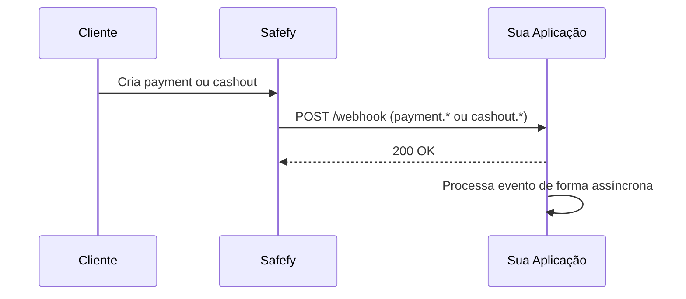
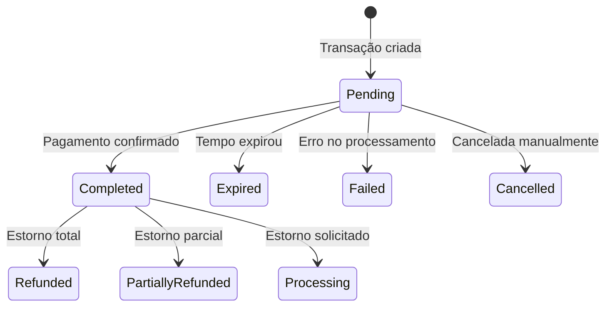

Webhooks permitem que sua aplicação seja notificada automaticamente quando ocorrerem mudanças em **payments** e **cashouts**.

## Como funciona

Ao criar um payment ou um cashout com `callbackUrl`, a Safefy envia uma requisição HTTP `POST` para essa URL sempre que o status muda para um estado relevante.



Para payloads completos por domínio, veja:

- [Webhooks de transação](/api-reference/transactions/webhooks)
- [Webhooks de saque](/api-reference/cashouts/webhooks)

---

## Eventos de payment

| Evento | Descrição | Quando acontece |
|--------|-----------|-----------------|
| `payment.completed` | Pagamento confirmado | Quando o PIX é pago e confirmado pelo banco |
| `payment.expired` | Transação expirou | Quando o prazo para pagamento esgota |
| `payment.failed` | Falha no processamento | Quando ocorre erro na adquirente ou validação |
| `payment.cancelled` | Pagamento cancelado | Quando o pagamento é cancelado manualmente |
| `payment.refunded` | Estorno total | Quando um pagamento confirmado é estornado |
| `payment.partially_refunded` | Estorno parcial | Quando parte do pagamento é estornada |
| `payment.refund_requested` | Estorno solicitado | Quando o estorno entra em processamento |

---

## Eventos de cashout

| Evento | Status do saque |
|--------|-----------------|
| `cashout.completed` | `Completed` |
| `cashout.failed` | `Failed` |
| `cashout.rejected` | `Rejected` |
| `cashout.cancelled` | `Cancelled` |

---

## Headers enviados

| Header | Descrição |
|--------|-----------|
| `X-Safefy-Signature` | Assinatura HMAC-SHA256 para validação |
| `X-Safefy-Event` | Tipo do evento (`payment.*` ou `cashout.*`) |
| `X-Safefy-Delivery` | ID único da entrega |
| `X-Safefy-Attempt` | Número da tentativa (`1`, `2`, `3`) |

---

## Assinatura

- Para eventos `payment.*`, o segredo é o `paymentId`.
- Para eventos `cashout.*`, o segredo é o `payoutId`.

Sempre valide a assinatura antes de processar o webhook.

---

## Retries

Se sua aplicação não responder com `2xx`, a Safefy tenta novamente:

1. Tentativa 1 (imediata)
2. Tentativa 2 após ~2 segundos
3. Tentativa 3 após ~4 segundos

Recomendação: confirme rápido (`200 OK`) e processe em background.

---

## Idempotência

Como podem existir retries, trate o processamento como idempotente.

- Chave recomendada: `id` (delivery id) ou `data.id + type`
- Ignore eventos já processados para evitar duplicidade

---

## Exemplo rápido

```json
{
  "id": "4d955fd7-cbb9-4d3c-8d36-4cb5de773b35",
  "type": "cashout.completed",
  "createdAt": "2026-02-25T12:00:00Z",
  "data": {
    "id": "8f8fce31-5c83-42c4-b90b-c29636b595e3",
    "status": "Completed",
    "amount": 50000,
    "netAmount": 49000
  }
}
```

---

## Fluxo de status de payment

Entenda o ciclo de vida de uma transação e quando cada webhook é disparado:



| Tentativa | Intervalo |
|-----------|-----------|
| 1 | Imediato |
| 2 | 2 segundos |
| 3 | 4 segundos |

---

## Boas praticas

<CardGroup cols={2}>
  <Card title="Responda rápido" icon="bolt">
    Retorne 200 OK imediatamente e processe o webhook de forma assíncrona.
  </Card>
  <Card title="Seja idempotente" icon="repeat">
    Use o id do webhook para evitar processar o mesmo evento duas vezes.
  </Card>
  <Card title="Valide a assinatura" icon="shield-check">
    Sempre verifique X-Safefy-Signature antes de confiar no payload.
  </Card>
  <Card title="Use HTTPS" icon="lock">
    Configure sua callbackUrl apenas com HTTPS em produção.
  </Card>
</CardGroup>
